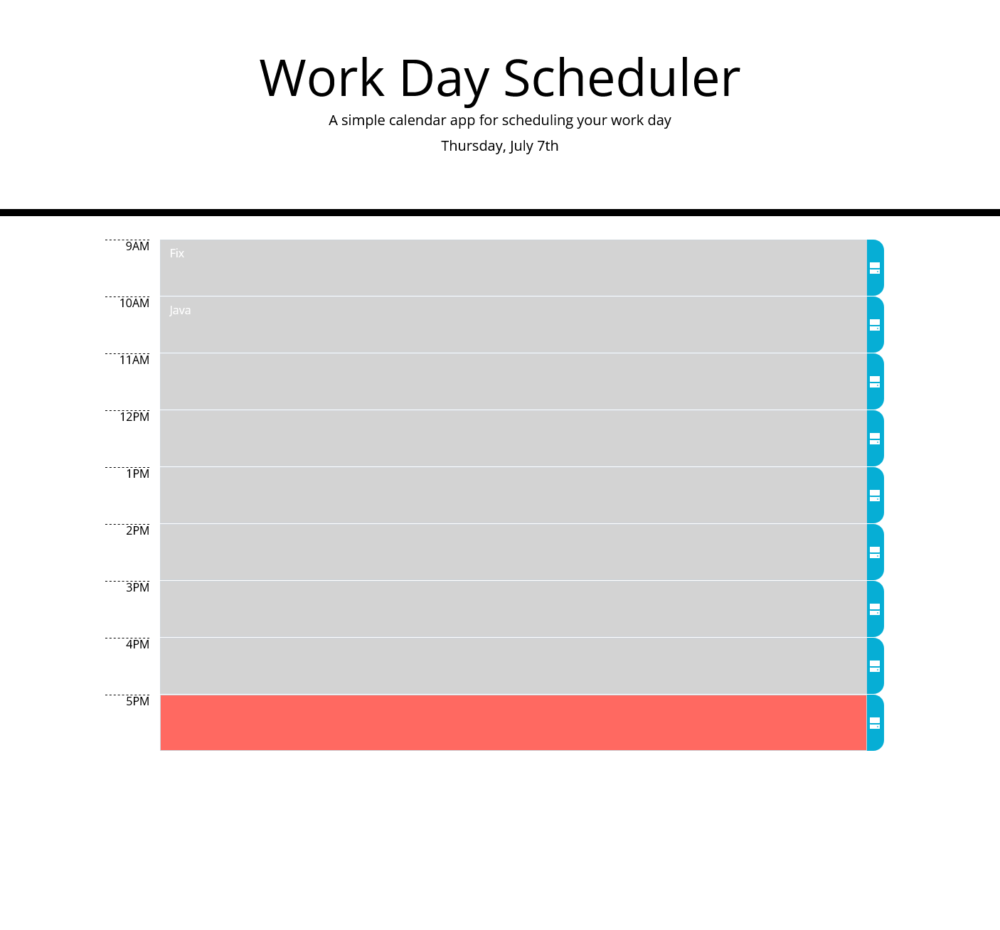

# Work Scheduler

This is an app developed to keep tasks throughout the day, using JavaScript, HTML and CSS. If the user writes in a task and presses the save button, their work will be saved to localstorage
where it is later retrieved should they come back to the page.

Deploy Link: https://maxkottong.github.io/Work-Scheduler/
